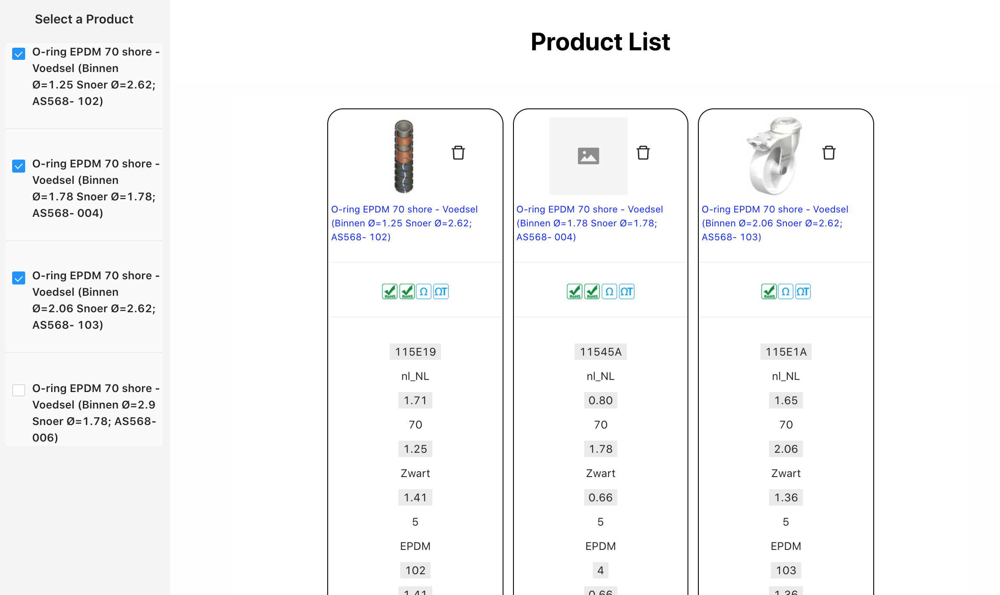
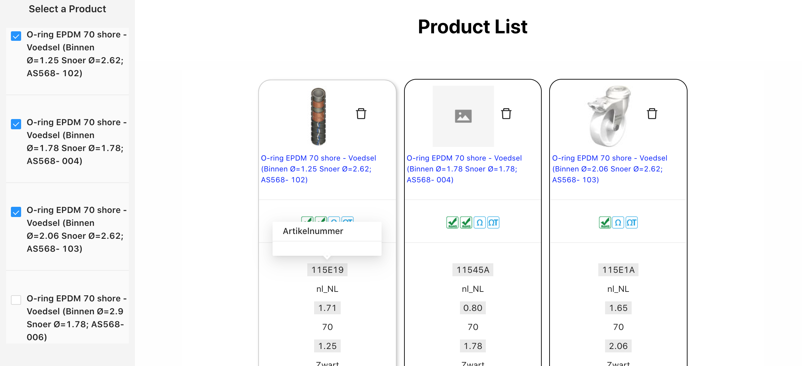
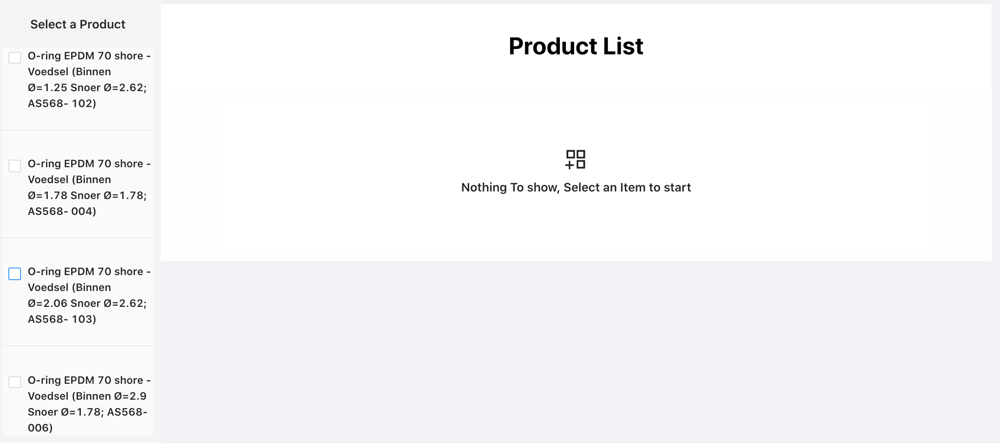
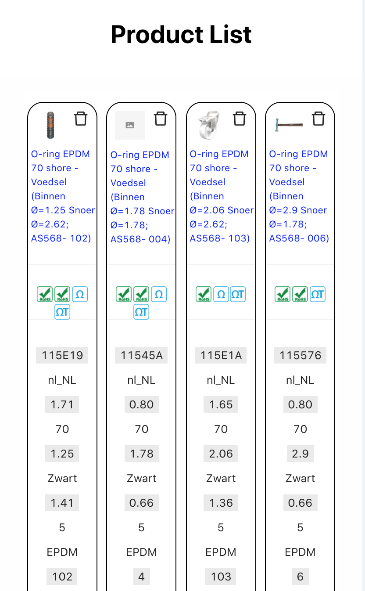

# Product Comparable

> A Reactjs Application that compare between different products

Deployed at : https://chohra-med.github.io/compareProduct/ 

> tags: #react #ES6 #BABEL #WebPack #Redux #redux-saga #AntD
>
Products List         |  Show Difference Between products
:-------------------------:|:-------------------------:
  | 

Empty Selected List          |  Responsivity of products
:-------------------------:|:-------------------------:
   |

> Features

- Select and Deselect Product Comparing
- Show Difference between product 
- PopUp Attributes when clicking on it 
- Responsive View 

> Structure 

We used Redux Saga for our Project, and we divide it by Business Unit ( if we have more than Products, 
we would have added that Entity the same way as Products ( SOLID principle)
- /public 
    The folder with fronted 
- /src
    - assets:  containts all the assets (Screenshots, Icons...)
    - component: Contains the reused component either it is commun such as Header or for a specific element like product component which contains ListProduct and ProductItem  
    - config :  Contains the ApiCall class with our ROOT URL and functions to access to them
    - constants: Contains constants, such as general colors and phrases
    - helpers: Contains functions that are used to do different operations that help us in Redux
    - pages: Contains the app pages, the one that are going to be dispayed
    - redux: Contains the Redux Saga folders.
    - services: Contains the service calling function ( call API for example), and general function that we use to communicate with the Redux Saga
- /__tests __ : where we put our tests
    

## Installation

- npm install
- npm run start

## Support

Reach out to me at my email address

-  chohra.mohammed.1@gmail.com

---

## License

- **[MIT license](http://opensource.org/licenses/mit-license.php)**
- Copyright 2020 © 
